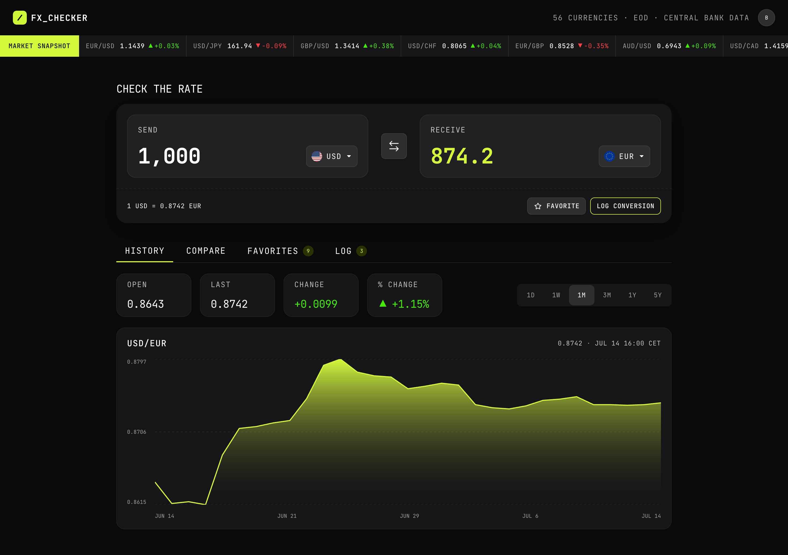

# Frontend Mentor - FX Checker Solution

This is a solution to the [FX Checker challenge on Frontend Mentor](https://www.frontendmentor.io/challenges/foreign-exchange-currency-converter). FX Checker is a small Next.js application for exploring exchange-rate data. It started from the Supabase Next.js starter and is being refined into a focused product slice, beginning with a server-rendered home page that reads currency metadata from Frankfurter.

## Table of Contents

- [Overview](#overview)
  - [The Challenge](#the-challenge)
  - [Current Status](#current-status)
- [Process](#process)
  - [Built With](#built-with)
  - [Architecture Notes](#architecture-notes)
  - [What I Learned](#what-i-learned)
  - [Continued Development](#continued-development)
  - [AI Collaboration](#ai-collaboration)
- [Development](#development)
  - [Project Structure](#project-structure)
  - [Environment](#environment)
  - [Quality Gates](#quality-gates)
- [Decisions](#decisions)

## Overview

### The challenge

Your users should be able to:

#### Converter

- Enter an amount to send and see it convert in real time as they type
- Pick the "send" and "receive" currencies from a searchable currency picker
- See the live exchange rate for the active pair (for example, `1 USD = 0.8530 EUR`)
- Swap the send and receive currencies with the swap button
- Favorite the active pair, and log a conversion to their history

#### Currency picker

- Search the full list of available currencies by code or name
- See currencies grouped into "Popular" and "Other currencies", each row showing the flag, code, and name
- See a check against the currency that's currently selected

#### Live markets ticker

- See a ticker of currency pairs, each with its current rate and 24-hour change (up or down)

#### Rate history

- View a line and area chart of the active pair's rate over time
- Switch the chart range between 1D, 1W, 1M, 3M, 1Y, and 5Y
- See the open, last, absolute change, and percentage change for the selected range

#### Compare

- See their send amount converted into a range of other currencies at once, each with its reference rate
- Pin or unpin any comparison row to their favorites

#### Favorites

- See their pinned pairs, each with its live rate and 24-hour change
- Load a pinned pair back into the converter by selecting its row
- Unpin a pair they no longer want to track

#### Conversion log

- See a log of conversions they've made, each showing the relative time, the pair, and the send and receive amounts
- Clear the whole log
- Delete an individual entry

#### UI & accessibility

- View the optimal layout for the interface depending on their device's screen size
- See hover and focus states for all interactive elements on the page
- Navigate the entire app using only their keyboard

### Screenshot



### Links

- Solution URL: [https://www.frontendmentor.io/solutions/full-stack-currency-converter-E-JW3OiQsy](https://www.frontendmentor.io/solutions/full-stack-currency-converter-E-JW3OiQsy)
- Live Site URL: [https://fx-checker.vercel.app](https://fx-checker.vercel.app)

## Process

### Built With

- [Next.js](https://nextjs.org/) App Router with React Server Components
- [React](https://react.dev/) 19
- [TypeScript](https://www.typescriptlang.org) 5
- [Supabase](https://supabase.com/) starter wiring for database and auth
- [Tailwind CSS](https://tailwindcss.com/) for themed reusable CSS
- [Vitest](https://vitest.dev/) for unit tests
- [Cypress](https://www.cypress.io/) for end-to-end tests
- [GitHub Actions](https://docs.github.com/en/actions) for CI
- [D3](https://d3js.org) for data visualization
- [Vercel](https://vercel.com) for deployment and hosting

### What I Learned

- Next.js App Router and React Server Components for server rendering and other performance features
- caching external APIs for faster and more reliable data fetching
- collaborating with AI to accelerate pixel-perfect UI development
- building components with custom input masking, keyboard navigation, WCAG patterns, CSV export, and data viz
- optimizing FCP and LCP through resource caching, server rendering, and server actions
- UX enhancements for keyboard and screen reader users
- polishing interactions with subtle transitions

### Continued Development

Next areas of focus:

- Digging deeper into Next.js
- Collaborating with AI to build richer marketing UX
- Building and designing more complex custom features

### AI Collaboration

AI assistance was used as a pair-programming partner: brainstorming architecture trade-offs, documenting ADRs, implementing functionality, adversarially reviewing changes, debugging, and exploring new tech. Codex and GPT 5.5 were used for tooling.

Collaborating on UI development went well. AI built UI chunks using Tailwind that were visually accurate enough that most of my time during this phase was spent on polish and validation. Accessibility generated out of the box left something to be desired and needed to be refined by hand.

AI also made a breeze of backend development and performance optimizations. Experimentation came cheap which made it easy to build and fine tune a robust system.

## Development

### Project Structure

The app uses Next.js App Router at the repository root and keeps product code outside `app/` unless the file is part of routing.

```text
app/         Route segments, route handlers, layouts, and route-level fallbacks.
components/  Shared, product-agnostic UI primitives and auth shell components.
features/    Product modules organized by domain.
hooks/       Shared React hooks used across multiple features or UI primitives.
lib/         Cross-cutting infrastructure, external integrations, and generic utilities.
public/      Static assets served by Next.js.
stories/     Storybook stories for reusable UI components.
docs/adr/    Architecture decision records.
```

Feature folders should expose their public route-facing API through `features/<feature>/index.ts` when practical. Inside a feature, files are grouped by role:

```text
features/<feature>/
  api/         Client/server calls, server actions, route-facing data access, and mutations.
  components/  Feature-owned React components.
  hooks/       Hooks that are only meaningful for that feature.
  model/       Pure domain logic, types, parsing, formatting, and derived view models.
  stores/      Client-side or cookie-backed state stores and optimistic state helpers.
  testing/     Feature-specific test data or helpers.
```

Not every feature needs every folder. Small features can stay flat until there is more than one meaningful module type. Shared hooks belong in `hooks/`, not `components/ui/`, unless they are truly private implementation details of a single UI primitive.

Install dependencies:

```bash
pnpm install
```

Run the local development server:

```bash
pnpm dev
```

The app runs at [localhost:3000](http://localhost:3000).

### Environment

The Supabase starter expects these variables when authentication-backed flows are used:

```env
NEXT_PUBLIC_SUPABASE_URL=
NEXT_PUBLIC_SUPABASE_PUBLISHABLE_KEY=
SUPABASE_SERVICE_ROLE_KEY=
```

The Frankfurter integration can be pointed at another compatible API base URL for tests or local development:

```env
FRANKFURTER_API_BASE_URL=
FRANKFURTER_CACHE_KEY=
```

The Frankfurter cache warmup cron route is protected with a bearer secret:

```env
CRON_SECRET=
APP_ORIGIN=
```

### Quality Gates

Run the same checks used by CI:

```bash
pnpm typecheck
pnpm lint
pnpm format:check
pnpm test:unit
pnpm test:e2e
```

The CI workflow keeps these gates separate so failures are easy to identify: type checking, linting, formatting, unit tests, and Cypress end-to-end tests.

## Decisions

Initial architecture decisions are recorded in [docs/adr](docs/adr/README.md). The ADRs explain why the project uses the Supabase starter, Next.js App Router, React Server Components, Tailwind, lightweight caching, simple logging, and explicit CI gates.
